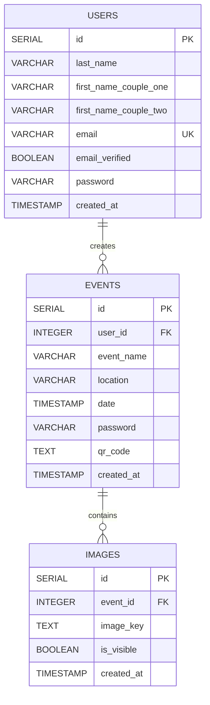

## Overview

Brautcloud Backend uses PostgreSQL as its relational database to store users, events, and image metadata. The application uses Spring Data JPA with automatic schema initialization.

## Database Setup

### Using Docker Compose

The easiest way to set up PostgreSQL is using the included `compose.yaml` file:

```yaml
services:
  postgres:
    image: 'postgres:latest'
    environment:
      - 'POSTGRES_DB=mydatabase'
      - 'POSTGRES_PASSWORD=secret'
      - 'POSTGRES_USER=myuser'
    ports:
      - '5432:5432'
```

<Steps>
  <Step title="Start PostgreSQL">
    Run Docker Compose to start the PostgreSQL container:
    ```bash
    docker compose up -d postgres
    ```
  </Step>
  
  <Step title="Verify Connection">
    Check that PostgreSQL is running:
    ```bash
    docker compose ps
    ```
  </Step>
  
  <Step title="Configure Environment Variables">
    Set the database connection variables (see [Environment Variables](/configuration/environment)):
    - `POSTGRES_URL=jdbc:postgresql://localhost/mydatabase`
    - `POSTGRES_USER=myuser`
    - `POSTGRES_PW=secret`
  </Step>
</Steps>

### Manual PostgreSQL Installation

If you prefer to install PostgreSQL manually:

1. Install PostgreSQL 14 or later
2. Create a database named `mydatabase`
3. Create a user with appropriate permissions
4. Update the environment variables to match your configuration

## Database Schema

The application automatically initializes the database schema on startup using the `schema.sql` file.

<Info>
  **Automatic Initialization**: The `spring.sql.init.mode=always` property ensures the schema is created automatically when the application starts.
</Info>

### Entity Relationship Diagram



### Users Table

Stores wedding couple information and authentication credentials.

<ParamField path="id" type="SERIAL" required>
  Primary key, auto-incrementing integer
</ParamField>

<ParamField path="last_name" type="VARCHAR(255)" required>
  Shared last name of the couple
</ParamField>

<ParamField path="first_name_couple_one" type="VARCHAR(255)">
  First name of the first person in the couple
</ParamField>

<ParamField path="first_name_couple_two" type="VARCHAR(255)">
  First name of the second person in the couple
</ParamField>

<ParamField path="email" type="VARCHAR(255)" required>
  Email address (unique constraint)
</ParamField>

<ParamField path="email_verified" type="BOOLEAN" default="false">
  Whether the email has been verified
</ParamField>

<ParamField path="password" type="VARCHAR(255)" required>
  Hashed password for authentication
</ParamField>

<ParamField path="created_at" type="TIMESTAMP" default="CURRENT_TIMESTAMP">
  Timestamp when the user was created
</ParamField>

### Events Table

Stores wedding event details and guest access information.

<ParamField path="id" type="SERIAL" required>
  Primary key, auto-incrementing integer
</ParamField>

<ParamField path="user_id" type="INTEGER" required>
  Foreign key reference to users table (CASCADE DELETE)
</ParamField>

<ParamField path="event_name" type="VARCHAR(255)" required>
  Name of the wedding event
</ParamField>

<ParamField path="location" type="VARCHAR(255)">
  Wedding venue location
</ParamField>

<ParamField path="date" type="TIMESTAMP">
  Date and time of the wedding event
</ParamField>

<ParamField path="password" type="VARCHAR(255)">
  Optional password for guest access to the event
</ParamField>

<ParamField path="qr_code" type="TEXT">
  QR code data for easy guest access
</ParamField>

<ParamField path="created_at" type="TIMESTAMP" default="CURRENT_TIMESTAMP">
  Timestamp when the event was created
</ParamField>

### Images Table

Stores metadata for uploaded wedding photos. Actual image files are stored in S3.

<ParamField path="id" type="SERIAL" required>
  Primary key, auto-incrementing integer
</ParamField>

<ParamField path="event_id" type="INTEGER" required>
  Foreign key reference to events table (CASCADE DELETE)
</ParamField>

<ParamField path="image_key" type="TEXT" required>
  S3 object key for retrieving the image file
</ParamField>

<ParamField path="is_visible" type="BOOLEAN" default="true">
  Whether the image is visible to guests (for moderation)
</ParamField>

<ParamField path="created_at" type="TIMESTAMP" default="CURRENT_TIMESTAMP">
  Timestamp when the image was uploaded
</ParamField>

## JPA Entity Models

The database schema is defined using JPA entities with Lombok annotations:

### User Entity

```java src/main/java/com/domenicwalther/brautcloud/model/User.java
@Entity
@Table(name = "users")
public class User {
    @Id
    @GeneratedValue(strategy = GenerationType.IDENTITY)
    private Long id;
    
    private String lastName;
    private String firstNameCoupleOne;
    private String firstNameCoupleTwo;
    private String email;
    private boolean emailVerified;
    private String password;
    
    @Column(insertable = false, updatable = false)
    private LocalDateTime createdAt;
    
    @OneToMany(mappedBy = "user")
    private List<Event> events;
}
```

### Event Entity

```java src/main/java/com/domenicwalther/brautcloud/model/Event.java
@Entity
@Table(name = "events")
public class Event {
    @Id
    @GeneratedValue(strategy = GenerationType.IDENTITY)
    private Long id;
    
    @ManyToOne
    @JoinColumn(name = "user_id")
    private User user;
    
    private String eventName;
    private String location;
    private LocalDateTime date;
    private String password;
    private String qrCode;
    
    @Column(insertable = false, updatable = false)
    private LocalDateTime createdAt;
    
    @OneToMany(mappedBy = "event")
    private List<Image> images;
}
```

### Image Entity

```java src/main/java/com/domenicwalther/brautcloud/model/Image.java
@Entity
@Table(name = "images")
public class Image {
    @Id
    @GeneratedValue(strategy = GenerationType.IDENTITY)
    private Long id;
    
    @ManyToOne
    @JoinColumn(name = "event_id")
    private Event event;
    
    private String imageKey;
    private boolean isVisible;
    
    @Column(insertable = false, updatable = false)
    private LocalDateTime createdAt;
}
```

## Connection Configuration

The database connection is configured in `application.properties`:

```properties
spring.datasource.url=jdbc:postgresql://localhost/mydatabase
spring.datasource.username=myuser
spring.datasource.password=secret
spring.sql.init.mode=always
```

<Warning>
  **Production Deployment**: In production, always use environment variables for database credentials and never commit them to version control. Use Doppler or similar secrets management tools.
</Warning>

## Database Initialization

The schema is automatically initialized from `src/main/resources/schema.sql` when the application starts:

```sql schema.sql
-- Create users table
CREATE TABLE IF NOT EXISTS users (
  id SERIAL PRIMARY KEY,
  last_name VARCHAR(255) NOT NULL,
  first_name_couple_one VARCHAR(255),
  first_name_couple_two VARCHAR(255),
  created_at TIMESTAMP DEFAULT CURRENT_TIMESTAMP,
  email VARCHAR(255) UNIQUE NOT NULL,
  email_verified BOOLEAN DEFAULT FALSE,
  password VARCHAR(255) NOT NULL
);

-- Create events table
CREATE TABLE IF NOT EXISTS events (
  id SERIAL PRIMARY KEY,
  event_name VARCHAR(255) NOT NULL,
  location VARCHAR(255),
  date TIMESTAMP,
  created_at TIMESTAMP DEFAULT CURRENT_TIMESTAMP,
  password VARCHAR(255),
  qr_code TEXT,
  user_id INTEGER NOT NULL,
  FOREIGN KEY (user_id) REFERENCES users(id) ON DELETE CASCADE
);

-- Create images table
CREATE TABLE IF NOT EXISTS images (
  id SERIAL PRIMARY KEY,
  image_key TEXT NOT NULL,
  is_visible BOOLEAN DEFAULT TRUE,
  created_at TIMESTAMP DEFAULT CURRENT_TIMESTAMP,
  event_id INTEGER NOT NULL,
  FOREIGN KEY (event_id) REFERENCES events(id) ON DELETE CASCADE
);
```

<Info>
  **CASCADE DELETE**: The schema uses `ON DELETE CASCADE` to automatically delete child records when a parent is deleted. For example, deleting a user will delete all their events and associated images.
</Info>

## Migration Strategy

For production deployments, consider using a database migration tool:

<CardGroup cols={2}>
  <Card title="Flyway" icon="plane-departure">
    Version-based migration tool with strong Java/Spring integration
  </Card>
  <Card title="Liquibase" icon="flask">
    Flexible migration tool supporting multiple database types
  </Card>
</CardGroup>

## Troubleshooting

<AccordionGroup>
  <Accordion title="Connection refused errors">
    - Verify PostgreSQL is running: `docker compose ps`
    - Check the port is correct (default 5432)
    - Ensure `POSTGRES_URL` includes the correct hostname
  </Accordion>
  
  <Accordion title="Schema not created">
    - Verify `spring.sql.init.mode=always` is set in `application.properties`
    - Check application logs for SQL errors
    - Ensure the database user has CREATE TABLE permissions
  </Accordion>
  
  <Accordion title="Authentication failures">
    - Verify `POSTGRES_USER` and `POSTGRES_PW` match your database configuration
    - Check that Doppler is running and secrets are loaded
    - Ensure the database user exists in PostgreSQL
  </Accordion>
</AccordionGroup>

## Next Steps

<CardGroup cols={2}>
  <Card title="Storage Configuration" icon="hard-drive" href="/configuration/storage">
    Set up S3 storage for image files
  </Card>
  <Card title="Environment Variables" icon="gear" href="/configuration/environment">
    Configure all required environment variables
  </Card>
</CardGroup>